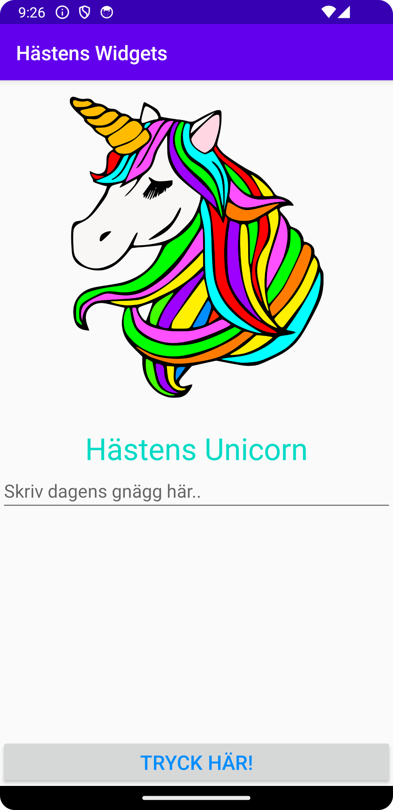

# Rapport

I denna appen har jag fyra olika widgets, ImageView, TextView, EditText och Button.

En widget lägs in i activity_main.xml och görs antingen använda det inbygda Design-läget där arbetar
man mer eller mindre med att lägga in widgets genom "drag-and-drop". Men jag valde att istället koda
in mina widgets i kod-läget.

Med följande kod läggs en widget in:

```
<ImageView
android:id="@+id/imageView"
android:layout_width="300dp"
android:layout_height="300dp"
android:contentDescription="@string/img_desc"
app:layout_constraintBottom_toTopOf="@id/text"
app:layout_constraintEnd_toEndOf="parent"
app:layout_constraintStart_toStartOf="parent"
app:srcCompat="@drawable/unicorn" />
```
Till att börja med så specifieras vilken typ av widget som ska läggas in gen om att skriva in
<ImageView. Därefter sätter man både bredd och höjd med hjälp av `android:layout_width="300dp"` och
`android:layout_height="300dp"` I detta fall satte jag höjd och bredd på 300 dp för att bilden ska 
hamna innanför skärmen. Då min 'ImageView' har en ConstraintLayout så valde jag att botten på
ImageView ska förhålla sig till toppen av 'TextView' som jag skapat på liknande sätt som 'ImageView'
fast med lite andra värden. Bilden lades till genom att importera den till "Recource Manager" och
därefter skriva in `app:srcCompat="@drawable/unicorn"`.

På TextView lade jag även till `android:paddingTop="30sp"` för att ge en distans mellan ImageView
och TextView. Här valdes `android:layout_height="wrap_content"` och `android:layout_width="wrap_content"`
då "wrap_contet" gör så att widgeten inte behöver vara större än den plats som texten tar.
Även en större textstorlek valdes genom att addera koden `android:textSize="30sp"`.

Widgeten 'EditText' lades också in på samma sätt men här är bredden satt till 
`android:layout_width="match_parent"` så att textrutan får samma bredd som appen.

Jag lade också in den text som ska syns i appen och ska kunna läsas av användaren i widgeten
i string.xml. Detta gjorde jag genom att skapa strings ex. `<string name="knapp">Tryck här!</string>`
som sedan länkas in till activity_main.xml.

Vidare har flera olika stylings gjortd på liknande sätt som beskriv i rapporten. Men att skriva
varje ändring som gjorts känns överflödigt och blir snabbt upprepande. Därför har jag valt att ha 
med de ändringar jag tycker är mest väsentliga.

